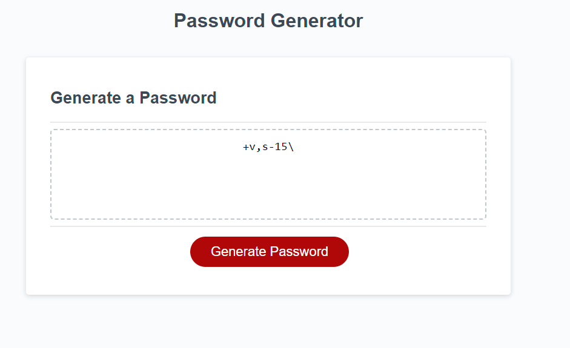

# Generate-Password

## Description

To better understand basic asspects of JavaScript.

To gain knowledge on variables, functions, if else and let for statements

Being able to generate a random password when given different characters

## Usage 
Enter the amount of characters.

Enter the specific characters you would like. 

See new password.

## Credits

Google.com

MDN 

W3 Schools

